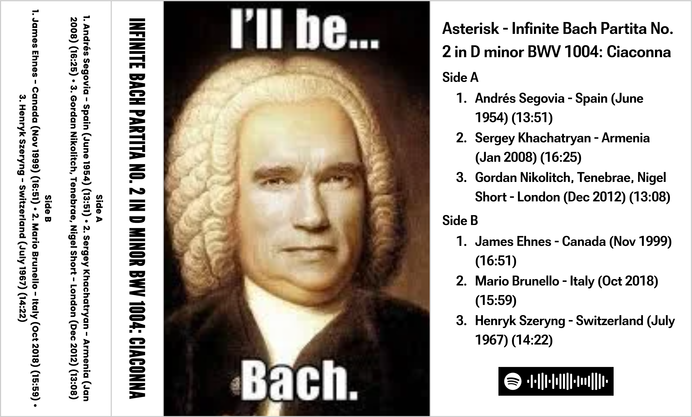

+++
title = "Infinite Bach Partita No. 2 in D minor BWV 1004: Ciaconna"
template = "mixtape.html"
date = 2024-05-01

[extra]
kind = "mixtape"
link_title = "infinite bach"
cover = "infinite-bach/jcard.png"
spotify_embed = "https://open.spotify.com/embed/playlist/3DKnnoDUXNf3sRrfqAD11g?utm_source=generator&si=acc04dc038144ab5"
gradient_from = "#8A8A8A"
gradient_to = "#2A2A2A"
title_leading = "0.95"
skip_asset_gallery = true
+++

Welcome to one of the greatest pieces of music that has ever been written.

Which is part of an arrangement of music that is undoubtedly the best compositional cycle for solo violin ever written, in the whole history of music, which some consider one of the greatest achivements of any man in history.

_(that's not just my opinion, it's the opinion of Joshua Bell, one of the worlds best violinists. that mother fucker busked in a subway playing this song with a multimillion-dollar Stradivarius violin one time...)_

J. S. FUCKING. B. A. C. H.

Oh yeah, it was also written ~300 years ago. The average performance time of this particular piece of the partita goes about ~16 minutes.

So now I can say... Sometimes you just get stuck on a song. Well this song has been my **one** song for at least two decades. I have listened to every variation I can get my hands on. I even partially melted the last known 1/4" reel-to-reel recording by an obscure 20's violinist accidently in a library one time.

Here are some of my "hot takes" for performers of Bach Partita No. 2 in D minor BWV 1004: Ciaconna.

> This was made into a mixtape for a cassette exchange with the theme of "drugs". Now, I didn't want to just do some hendrix mixtape. Everyone knows half the musicians that record are on drugs. But what if you heard the same song, just slightly different, over and over again for 90 minutes. Are YOU on drugs?!?

> There is also a much longer playlist than the mixtape [here](https://open.spotify.com/playlist/7aOL79407RCXSGYXzNEpM3?si=WWWFJu6dTNuqUw2usBaEOQ) — if you want the full experience.

My brief notes for artists included just in this mixtape. I don't think anyone will ever request my *complete* review for every performer forever, but I have it and its long...

> Andres Segovia — because fucking master on guitar. Why play the notes written when you fucking know what the vibe is from the start. This performance is almost not fair compared to others on the violin, the classical guitar style is very unique and I haven't heard anyone attempt it before. True brilliance.

> Segey khachatrian. Stattico and accurate. Downright surgical. Aggressive play style, leaving minor hints lost, but gaining consistency to the whole piece. Adds interpretation that has not been played before to this piece, through his playing style. You can hear his passion, and it never stops.

> Gordon Nicholich (tenebrae, Nigel short) w/ Chorales. Fucking REMIX. Not only is the violin fucking crazy cool, technically *amazing*, and with the passion of the song... You are getting the wildest chorale overlay, making for a god damned epic scene JSB would have been honestly proud of. Nicholich is robbed from an amazing solo performance here, he is *absolutely* unhinged, sections that are usually played slow are NOT, and playing off the choir and accentuating the most important subtleties of the piece, I'm torn. It is bittersweet with the straight epic nature of the voices layered on top. At times it does feel like listening to a studio mixdown without any other amazing parts? But FUCK IT. it goes too hard to be criticized at all. To witness this live, would have been undeniably pant shitting.

> James Ehnes — that timing is fucking wild my dude. It's straight but not somehow? I don't know what level of autism makes someone interpret sheet music like this, but I fucking like it. Not as lagging as I would have assumed on the technical parts, just a solid performance. 10/10

> Mario brunello (Cello) Deep follow through, very linear interpretation, so satisfying to hear the traditional playing, in such a beautiful non hurried way. Just so relaxed, it feels like the easiest piece of music in the world. Proud strings missing the sheet music for a reason, soaking up the emotion of the piece in his own way. DEEP bow pulls. 8/10

> Henryk Szeryng — hot damn, can you hang cloths from those fucking bow draws. The dude is as straight as an arrow. Obvious orchestra player? I don't think I've felt more formal listening to this song played before, need to get on my tuxedo and make sure the collar is straight and white. Fucking marching line classical we like to see. Yes sir, we are at ATTENTION! 9/10
