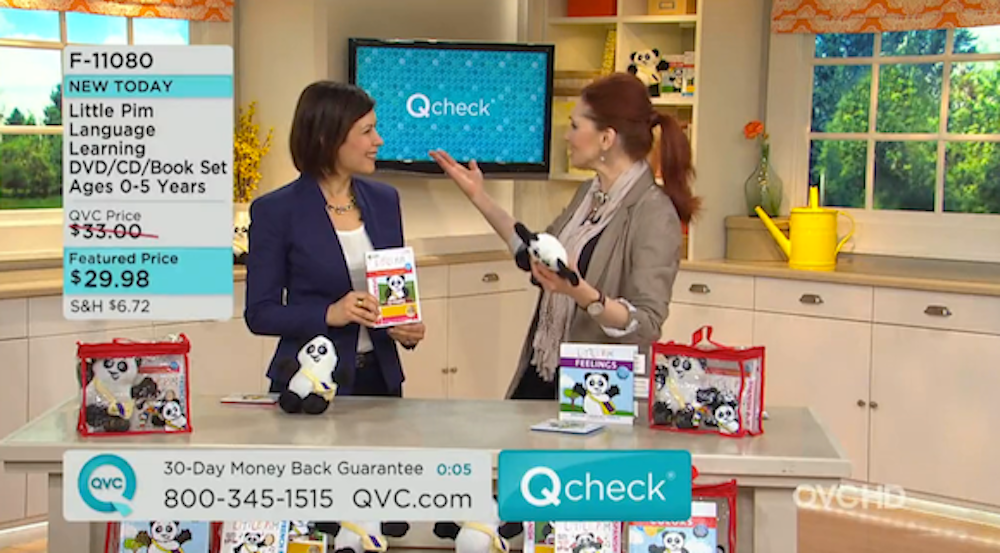
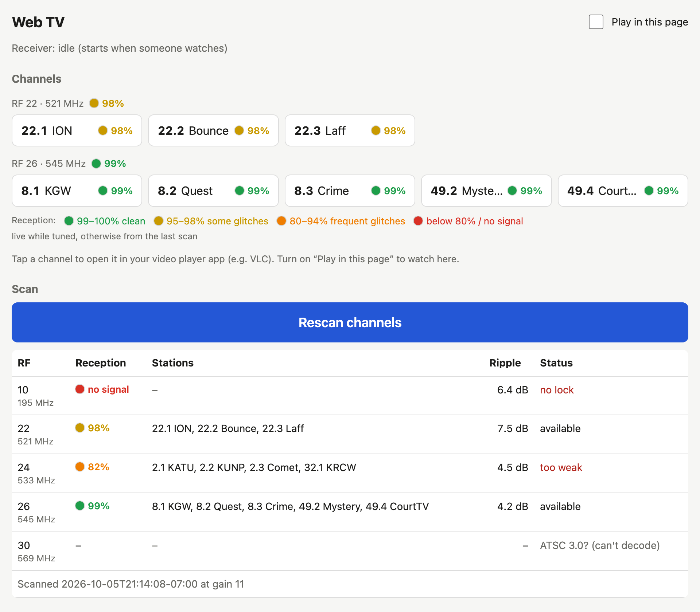

+++
title = "Raw dogging TV channels"
template = "project.html"
date = 2026-10-06

[extra]
kind = "project"
link_title = "raw dogging TV channels"
cover = "raw-dogging-tv/webtv.png"
gradient_from = "#FFB07A"
gradient_to = "#8EB0FF"
text = "#1A1433"
+++



Sometimes I enjoy pausing and figuring out a piece of technology or methodology that we often take for granted. A long while ago when everyone switched to "digital tv" broadcasting I actually never took a second look, but diving into how it gets done was pretty fascinating.

Once I realized that all TV channels are broadcasting on VHF/UHF frequencies, I knew I could probably decode those streams in real time. I've had a little SDR I wasn't using for anything ([Airspy](https://airspy.com/airspy-r2/)), and a ton of different antennas so I thought what the hell, let's try. It was also a good excuse to dive back into some signal processing libraries I haven't looked at in quite some time.

Things that blow my mind:

- My little tiny Airspy, which is powered over USB, can output 10 MSPS of raw IQ (and can do much more in other modes). That is just bad ass. That's 10 MILLION samples per SECOND.
- The broadcast channels are essentially streaming an MPEG transport stream, with its metadata and nice things (closed captioning, etc.) over the air, and also keeping a close enough spectrum variance that on a little old Intel NUC I can decode essentially 8 real time streams at the same time... reconstructed from raw signal data.
- You really can, with enough time and effort, gain knowledge from older technologies and apply that thinking to tons of different scenarios.
- I could probably build a pirate TV station...

Now, should you do this to normally watch TV? Absolutely not. It's so inefficient and there are hardware decoders that take care of all these problems, in a much better way, for not much money at all. Was it fun? Hell yes.

I regret nothing. Also nobody should really be using this project, outside the fact that it's just a couple Docker containers so you aren't investing into much by running it yourself.

## How it works

Antenna, then the Airspy, then software. The radio tunes one 6 MHz RF channel at a time and a [GNU Radio](https://www.gnuradio.org/) ATSC decoder turns those samples into the MPEG transport stream the station is already sending, about 19.4 Mbps. The virtual channels are programs inside that one stream, so a few of them play at once off the same tune. A station on a different RF channel has to wait while the radio retunes.

```
                                                             ┌─► webtv :80  (browser page, H.264 for browsers)
antenna ─► Airspy R2 ─► atsc-rx (on-demand tuner) ◄─ /rf/<n> ─┤
            (USB)       GNU Radio gr-dtv            MPEG-TS  └─► Tvheadend :9981 HTTP (M3U, XMLTV, streams)
                        127.0.0.1:5600                                     :9982 HTSP (Kodi)
```

`atsc-rx` is the tuner. It only decodes while someone is actually watching. [Tvheadend](https://tvheadend.org/) publishes the playlist, the guide, and the streams, so VLC, Kodi, and Jellyfin see the same channels. A web page lists them with a reception badge and can play in the browser.


_The page. Reception is 100 minus the packet error rate._

A scan walks the band and only keeps what locks. ATSC 3.0 shows up as a signal with no 8VSB pilot and stops there. This is 1.0.

Code is [on GitHub](https://github.com/0xVANISHED/atsc-airspy-docker-streaming).
