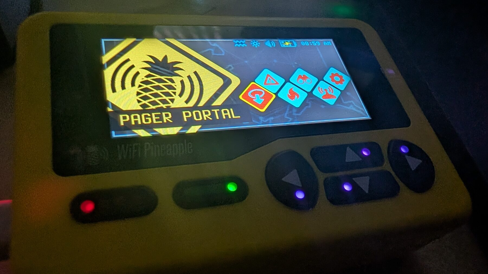
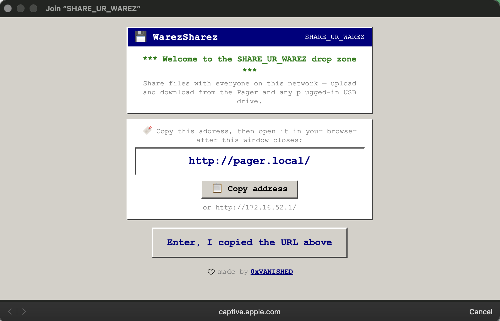
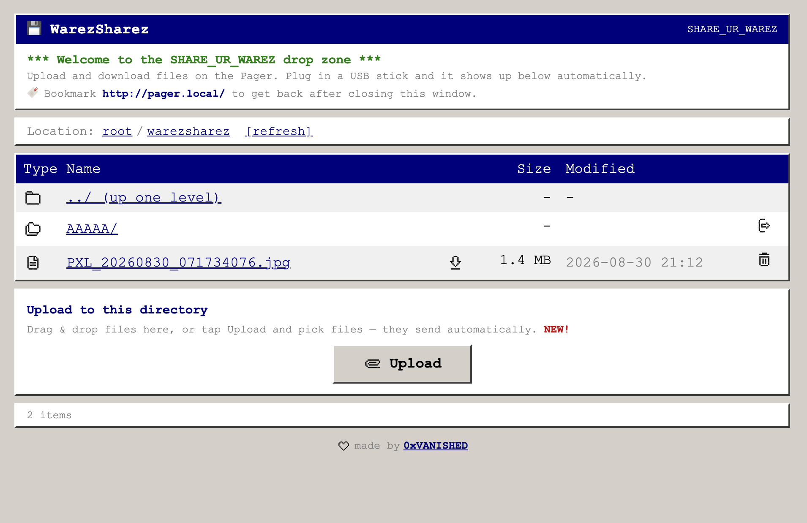

+++
title = "Share Ur Warez"
template = "project.html"
date = 2026-08-31

[extra]
kind = "project"
link_title = "share ur warez"
cover = "share-ur-warez/portal.png"
gradient_from = "#F3D34A"
gradient_to = "#7BC96A"
text = "#1C1638"
+++

## oh I only have that file on a usb drive

I have a [WiFi Pineapple Pager](https://hak5.org/products/wifi-pineapple-pager). Great little computer, right up until the file you need is on a USB stick, or a phone, or someone else's laptop, and you are standing there about to do scp in a parking lot. Or you just want to share stuff with friends on a whim. So the Pager turns on an open access point called `SHARE_UR_WAREZ`. Join it and a captive portal is started. Those are usually meant for evil intentions, but this project is just about straight utility.

Anyone who joins gets a simple web UI to upload and download files on the Pager. Plug a USB stick in and it shows up in the same list automatically.

_Join the network and this opens on its own._

_The drop zone. USB drives show up here on their own._

Source is [on GitHub](https://github.com/0xVANISHED/warez-sharez-pineapple-pager).
